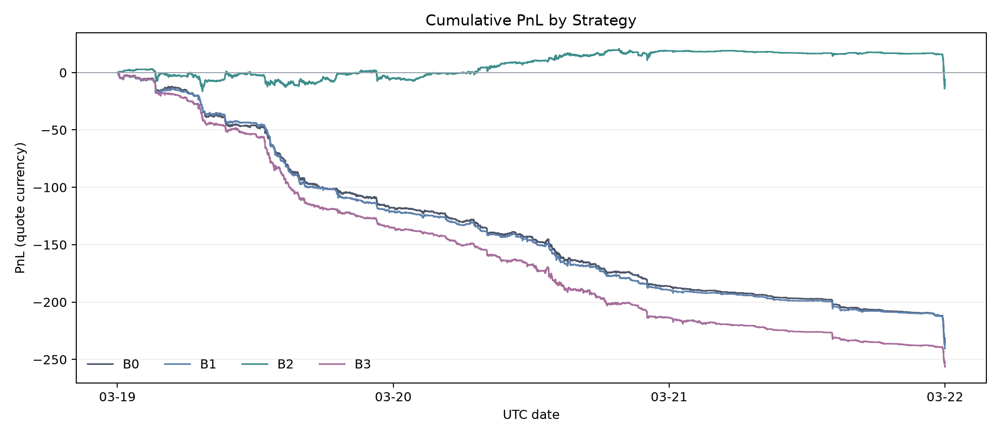
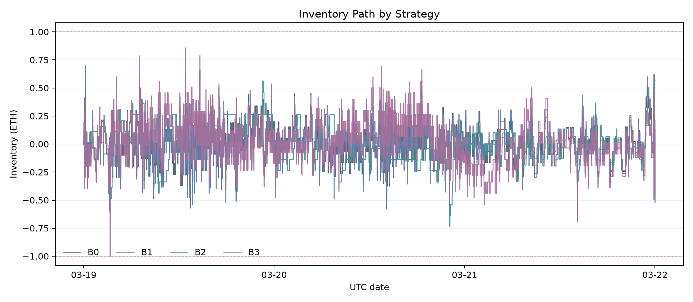
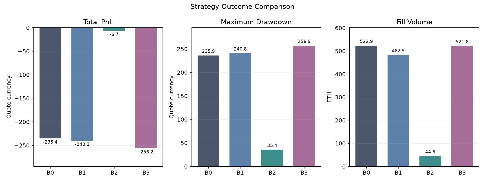

# Market-Making Backtest Results

## 1. Scope

The backtest covers ETH perpetual data from 2026-03-19 through 2026-03-21. It compares a baseline (B0) with three single-change variants (B1–B3).

The inventory-skew and volatility-multiplier sweeps use the same three-day samples as the final comparison. The selected eight-tick inventory skew and 5 volatility multiplier are in-sample parameters.

## 2. Strategy variants

| Variant | Change relative to B0 |
|---|---|
| B0 | Mid-price fair value, fixed spread, and zero-target inventory skew |
| B1 | Replace midpoint fair value with parameter-free L1 microprice |
| B2 | Add five 60-second root-mean-square price-volatility units to each quote side |
| B3 | Move target inventory against the latest observed funding rate |

B1, B2, and B3 are separate ablations. Each changes one B0 component.

## 3. Shared assumptions

- One 0.1 ETH order per side
- 1 ETH absolute inventory limit
- One-tick fixed full spread
- Eight-tick inventory skew at the inventory limit
- B2 volatility multiplier of 5
- 100 ms placement and cancellation latency
- Conservative visible-queue fill model
- Midpoint mark price
- Zero maker fee
- Funding observations used as signals, not cash settlements
- One-second account and quote sampling

The event ordering, fill, accounting, and strategy assumptions are documented in [`assumptions.md`](assumptions.md).

## 4. B0–B3 results

Gross and net PnL are equal because fees and funding cashflows are zero. All variants use the eight-tick inventory skew. B2 uses the 5 volatility multiplier.



| Metric | B0 | B1 | B2 | B3 |
|---|---:|---:|---:|---:|
| Total PnL | -235.370450 | -240.258400 | -6.683750 | -256.234800 |
| Maximum drawdown | 235.913200 | 240.809400 | 35.437750 | 256.860600 |
| Maximum absolute inventory (ETH) | 1.000000 | 1.000000 | 0.738000 | 1.000000 |
| Mean absolute inventory (ETH) | 0.117808 | 0.108155 | 0.136987 | 0.141961 |
| Fill count | 5,400 | 4,939 | 463 | 5,386 |
| Fill volume (ETH) | 522.893 | 482.540 | 44.633 | 521.796 |
| Fill rate (filled / submitted quantity) | 2.34% | 1.52% | 0.15% | 2.32% |
| Order fill rate | 2.59% | 1.63% | 0.15% | 2.56% |
| Average quoted spread | 0.252636 | 0.247482 | 1.561182 | 0.253566 |
| Captured half-spread | -0.035645 | -0.032063 | 0.227954 | -0.036114 |
| 1s execution markout | -0.429815 | -0.442373 | -0.465999 | -0.434476 |
| 5s execution markout | -0.445283 | -0.455473 | -0.544775 | -0.442066 |
| 30s execution markout | -0.493810 | -0.532243 | -0.652176 | -0.490346 |

Positive captured spread and markout benefit the maker. A negative markout means the future midpoint moved against the resting order after the fill.
Fill rate is filled base quantity divided by submitted order quantity. Markouts are weighted by filled quantity, not averaged by fill count.

### Daily PnL

| Date | B0 | B1 | B2 | B3 |
|---|---:|---:|---:|---:|
| 2026-03-19 | -117.790750 | -121.179600 | -4.983600 | -135.218350 |
| 2026-03-20 | -68.389150 | -68.321700 | 23.898050 | -78.266000 |
| 2026-03-21 | -49.190550 | -50.757100 | -25.598200 | -42.750450 |

None of the four variants is profitable over the full sample. B2 is profitable on March 20 only. The comparison measures changes in loss, execution quality and risk; it does not identify a profitable production strategy.





## 5. Parameter selection

### Inventory skew

The initial setting was two ticks at the 1 ETH inventory limit. At half the inventory limit,it moves the reservation price by one tick. The sweep varies only this maximum reservation-price shift.

| Inventory skew at limit | Total PnL | Maximum drawdown | Mean absolute inventory (ETH) | Maximum absolute inventory (ETH) | Fill count | Fill volume (ETH) |
|---:|---:|---:|---:|---:|---:|---:|
| 1 tick | -304.940800 | 306.274150 | 0.204692 | 1.000000 | 5,896 | 571.056 |
| 2 ticks (initial) | -294.902800 | 296.281150 | 0.185116 | 1.000000 | 5,837 | 565.886 |
| 3 ticks | -271.722700 | 273.101050 | 0.164751 | 1.000000 | 5,750 | 557.196 |
| 4 ticks | -266.850300 | 268.077450 | 0.149479 | 1.000000 | 5,675 | 550.354 |
| 5 ticks | -264.170750 | 265.164100 | 0.142984 | 1.000000 | 5,599 | 542.927 |
| 6 ticks | -250.927000 | 251.759350 | 0.130029 | 1.000000 | 5,538 | 536.542 |
| 7 ticks | -249.391250 | 250.070800 | 0.125320 | 1.000000 | 5,475 | 530.951 |
| 8 ticks (selected) | -235.370450 | 235.913200 | 0.117808 | 1.000000 | 5,400 | 522.893 |
| 9 ticks | -239.150700 | 239.541450 | 0.114547 | 1.000000 | 5,349 | 518.180 |
| 10 ticks | -244.457300 | 244.842450 | 0.112716 | 0.999000 | 5,337 | 517.120 |

**Measured:** Higher skew reduces mean inventory and trading activity. PnL and drawdown improve through eight ticks, then worsen at nine and ten ticks. Mean inventory falls across the full range. Ten ticks is the first case that does not reach the 1 ETH limit.

**Selection:** Eight ticks has the best PnL and drawdown in the tested range.

**Limitation:** The selection uses the evaluation sample and requires out-of-sample validation.

### Volatility multiplier

The B2 sweep fixes inventory skew at eight ticks and varies the volatility multiplier over `0.5/1.0/2.0/2.5/3.0/4.0/5.0/6.0/7.0/8.0`. The initial 1 setting adds one estimated one-second root-mean-square price move to each quote side.

| Volatility multiplier | Total PnL | Maximum drawdown | Mean absolute inventory (ETH) | Fill volume (ETH) | Fill rate | Average quoted spread | 1s markout |
|---:|---:|---:|---:|---:|---:|---:|---:|
| 0.5 | -168.492650 | 172.161100 | 0.100912 | 347.605 | 1.52% | 0.357447 | -0.431450 |
| 1.0 (initial) | -125.929050 | 129.129100 | 0.108073 | 238.969 | 1.03% | 0.490135 | -0.426125 |
| 2.0 | -78.084250 | 91.529800 | 0.122480 | 128.417 | 0.52% | 0.765422 | -0.457932 |
| 2.5 | -73.550200 | 90.602350 | 0.128512 | 102.932 | 0.41% | 0.903049 | -0.453726 |
| 3.0 | -67.098100 | 84.140650 | 0.135657 | 83.124 | 0.32% | 1.041106 | -0.458061 |
| 4.0 | -28.786250 | 44.468100 | 0.131317 | 59.229 | 0.21% | 1.308084 | -0.471312 |
| 5.0 (selected) | -6.683750 | 35.437750 | 0.136987 | 44.633 | 0.15% | 1.561182 | -0.465999 |
| 6.0 | -12.110250 | 37.184200 | 0.165453 | 33.609 | 0.10% | 1.790551 | -0.473925 |
| 7.0 | -0.631900 | 30.568750 | 0.182376 | 28.348 | 0.08% | 2.001293 | -0.478976 |
| 8.0 | 14.511350 | 30.687800 | 0.202143 | 23.801 | 0.06% | 2.191538 | -0.484936 |

**Measured:** Every tested multiplier improves PnL and drawdown relative to B0. Higher multipliers widen quotes and reduce fill volume. The 1s markout becomes more negative at the upper end of the range. The 8.0 case is the only positive in-sample result. PnL and drawdown both worsen from 5.0 to 6.0. Drawdown also increases from 7.0 to 8.0.

**Selection:** The 5.0 multiplier is the last tested point before PnL, drawdown, and inventory all worsen at 6.0. The 7.0 and 8.0 cases have fill rates below 0.10%.

**Limitation:** The deepest-visible-level clamp affects high-multiplier quotes.
The upper sweep points do not represent unconstrained quote widths. The selected multiplier is also in-sample. At 8.0, average spread is 2.191538, fill volume is 23.801 ETH, fill rate is 0.06%, and 1s markout is -0.484936. The higher PnL comes with less trading and worse post-fill movement.

## 6. Variant findings

### B0: baseline

**Measured:** B0 loses 235.370450 over the sample. Execution markout is negative at 1s, 5s, and 30s.

**Interpretation:** Passive fills are followed by adverse midpoint movement at every measured horizon.

### B1: L1 microprice

**Measured:** B1 increases total loss by 4.8880 and maximum drawdown by 4.8962 relative to B0. Fill count falls by 8.5%, quantity fill rate falls from 2.34% to 1.52%, and all execution markouts become more negative.

L1 imbalance still predicts the direction of future midpoint returns:

| Horizon | Strong-sell bucket | Strong-buy bucket |
|---|---:|---:|
| 1s | -0.272907 bps | 0.260408 bps |
| 5s | -0.579030 bps | 0.561121 bps |
| 30s | -0.997873 bps | 0.916350 bps |

**Interpretation:** The directional signal does not improve conditional passive fills. B1 does not improve PnL or execution quality.

**Limitation:** Queue position, quote replacement, and adverse selection affect whether a directional signal can be captured with passive orders.

### B2: volatility-adaptive spread

**Measured:** B2 reduces total loss by 228.6867 (97.2%) and maximum drawdown by 85%. Average quoted spread increases from 0.252636 to 1.561182 and fill count falls by 91.4%. Captured half-spread becomes positive. Mean absolute inventory increases by 16.3%, and execution markout is worse at every horizon.

Volatility buckets separate future absolute returns:

| Horizon | Lowest-volatility quintile | Highest-volatility quintile |
|---|---:|---:|
| 1s absolute return | 0.043739 bps | 0.768855 bps |
| 5s absolute return | 0.222755 bps | 2.481567 bps |
| 30s absolute return | 1.125206 bps | 6.463778 bps |

**Interpretation:** Trailing volatility predicts future move magnitude. B2 reduces loss mainly by quoting wider and trading less. Execution quality does
not improve.

**Limitation:** The 0.15% fill rate leaves few B2 executions. Results at wider settings are increasingly affected by the visible-book clamp.

### B3: funding-aware inventory target

**Measured:** B3 leaves spread, fills, and fill rate close to B0. Mean absolute inventory increases by 20.5%. Total loss increases by 20.8644 and maximum drawdown increases by 20.9474.

**Interpretation:** B3 shifts inventory with the funding signal but increases directional exposure and trading loss in this sample.

**Limitation:** Funding settlement times and accrual rules are unavailable. The backtest measures trading PnL and inventory risk, not funding income.

## 7. Key findings

### B0

The baseline loses money over the full sample. Execution markouts are negative at every horizon.

### B1

L1 imbalance predicts return direction, but the microprice variant reduces fill rate and does not improve PnL or markout.

### B2

The volatility-adjusted spread produces the largest reduction in loss and drawdown. Quotes become wider and trading activity falls sharply. Execution markouts remain negative.

### B3

The funding-aware target changes inventory bias but worsens trading PnL. It cannot be evaluated as a carry strategy without funding settlement cashflows.

The eight-tick skew and 5.0 volatility multiplier are in-sample selections.

## 8. Limitations

- One instrument and three consecutive days
- Visible-queue fills do not infer executions from book-size changes
- No hidden liquidity, queue-ahead cancellations, or venue matching details
- No cross-venue or spot hedge
- Zero maker fees because no fee schedule was supplied
- Zero funding cashflow because settlement metadata was unavailable
- PnL depends on latency and fill-model assumptions
- The three-day sample is too short for a reliable estimate of return-tail risk

## 9. Reproduction

Run each strategy:

```bash
uv run python -m src.commands.backtest_cli --strategy B0
uv run python -m src.commands.backtest_cli --strategy B1
uv run python -m src.commands.backtest_cli --strategy B2
uv run python -m src.commands.backtest_cli --strategy B3
```

Run the inventory-skew sensitivity:

```bash
uv run python -m src.commands.backtest_cli --inventory-skew-sensitivity
```

Run the signal diagnostics:

```bash
uv run python -m src.research.analyze_signals
```

Regenerate the figures:

```bash
uv run python -m src.commands.plot_results
```

Run all tests:

```bash
uv run python -m unittest discover -s tests -v
```
